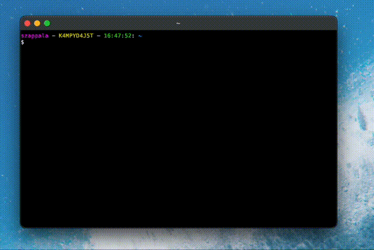

# Gattino 🐱

A kitty terminal extension that translates human language commands into bash commands using ollama.



## Installation

1. Clone the repository to `~/.config/kitty/gattino`

```bash
git clone https://github.com/szappala/gattino.git ~/.config/kitty/gattino
```

2. Add the following line to `~/.config/kitty/kitty.conf` (note, replace `cmd` with `ctrl` if you are not on a mac)

```bash
map cmd+shift+g kitten gattino/gattino.py
```

### Requirements
- [ollama](https://ollama.ai/)

## Configuration

The configuration is located in `~/.config/kitty/gattino/gattino.config.json` and the following options are available:

* `model`: The ollama model to use for command translation (default: "codellama")
* `ollama_path`: Path to the ollama executable (default: "/usr/local/bin/ollama")
